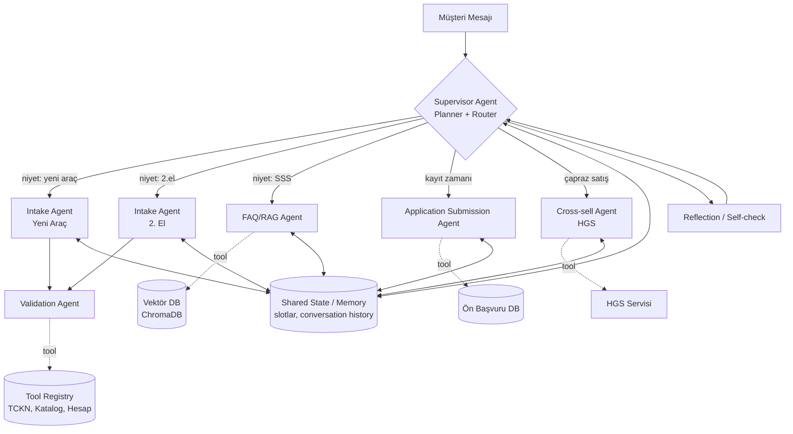
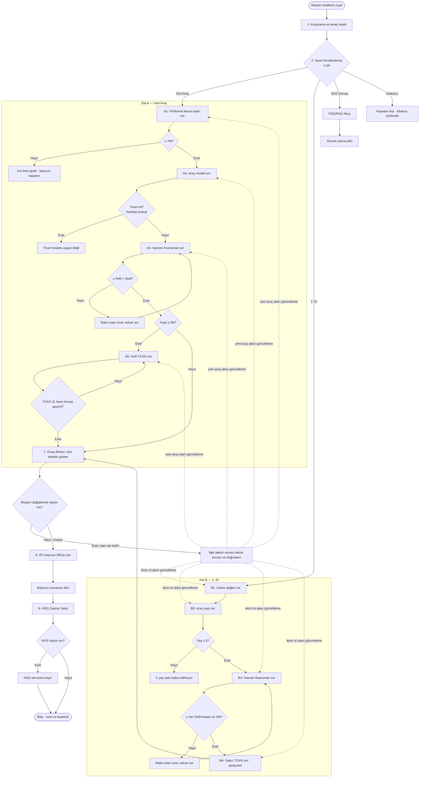
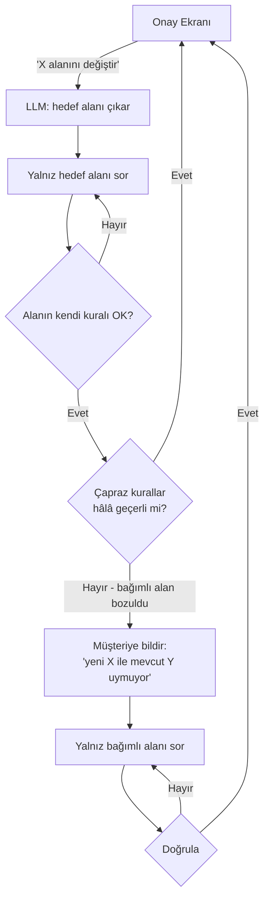
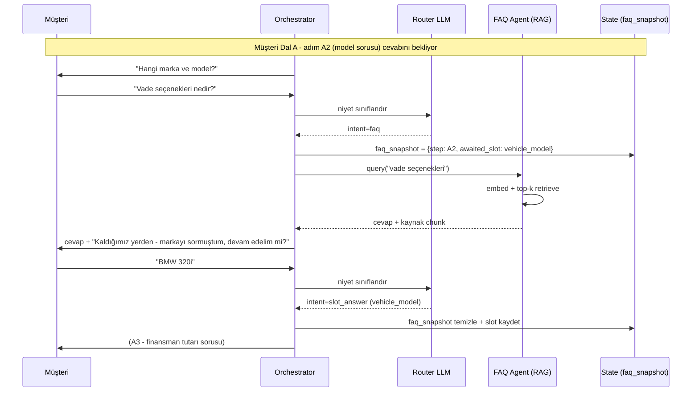

# Araç Finansmanı Chatbot — Diyagramlar

---

## 1. Agentic Tasarım

```mermaid
graph TD
    USR[Müşteri Mesajı] --> SUP{Supervisor Agent<br/>Planner + Router}

    SUP -->|niyet: yeni araç| INTAKE_NEW[Intake Agent<br/>Yeni Araç]
    SUP -->|niyet: 2.el| INTAKE_USED[Intake Agent<br/>2. El]
    SUP -->|niyet: SSS| FAQ[FAQ/RAG Agent]
    SUP -->|kayıt zamanı| APP[Application Submission Agent]
    SUP -->|çapraz satış| XS[Cross-sell Agent<br/>HGS]

    INTAKE_NEW --> VAL[Validation Agent]
    INTAKE_USED --> VAL
    VAL -.tool.-> TOOLS[(Tool Registry<br/>TCKN, Katalog, Hesap)]

    FAQ -.tool.-> VDB[(Vektör DB<br/>ChromaDB)]
    APP -.tool.-> APPDB[(Ön Başvuru DB)]
    XS -.tool.-> HGSAPI[HGS Servisi]

    SUP <--> MEM[(Shared State / Memory<br/>slotlar, conversation history)]
    INTAKE_NEW <--> MEM
    INTAKE_USED <--> MEM
    FAQ <--> MEM
    APP <--> MEM
    XS <--> MEM

    SUP --> REF[Reflection / Self-check]
    REF --> SUP
```

---

## 2. Use Case Workflow — Ana Akış

```mermaid
flowchart TD
    Start([Müşteri chatbot'u açar]) --> S1[1- Karşılama ve amaç teyidi]
    S1 --> S2{2- Niyet Sınıflandırma<br/>LLM}
    S2 -->|Yeni Araç| A1
    S2 -->|2. El| B1
    S2 -->|SSS Sorusu| F1[FAQ/RAG Akışı]
    S2 -->|Alakasız| OOS[Kapsam dışı - kibarca yönlendir]
    F1 --> Resume[Önceki adıma dön]

    subgraph NewCar["Dal A — Yeni Araç"]
        A1[A1- Proforma fatura tutarı sor] --> A1V{≤ 7M?}
        A1V -->|Hayır| AStop1[Üst limit aşıldı - başvuru kapatılır]
        A1V -->|Evet| A2[A2- Araç modeli sor]
        A2 --> A2V{Ticari mi?<br/>Katalog lookup}
        A2V -->|Evet| AStop2[Ticari modele uygun değil]
        A2V -->|Hayır| A3[A3- İstenen finansman sor]
        A3 --> A3V{≤ %60 × fiyat?}
        A3V -->|Hayır| A3F[Maks tutarı öner, tekrar sor]
        A3F --> A3
        A3V -->|Evet| A4{Fiyat ≥ 5M?}
        A4 -->|Evet| A5[A5- Kefil TCKN sor]
        A5 --> A5V{TCKN 11 hane format geçerli?}
        A5V -->|Hayır| A5
        A5V -->|Evet| Recap
        A4 -->|Hayır| Recap
    end

    subgraph Used["Dal B — 2. El"]
        B1[B1- Kasko değeri sor] --> B2[B2- Araç yaşı sor]
        B2 --> B2V{Yaş ≤ 5?}
        B2V -->|Hayır| BStop1[5 yaş üstü kabul edilmiyor]
        B2V -->|Evet| B3[B3- İstenen finansman sor]
        B3 --> B3V{"≤ min %40×kasko ve 3M?"}
        B3V -->|Hayır| B3F[Maks tutarı öner, tekrar sor]
        B3F --> B3
        B3V -->|Evet| B4[B4- Satıcı TCKN sor - opsiyonel]
        B4 --> Recap
    end

    Recap[7- Onay Ekranı: tüm alanları göster]
    Recap --> Edit{Müşteri değiştirmek istiyor mu?}
    Edit -->|Evet, alan adı belirt| GoTo[İlgili alanın sorusu tekrar sorulur ve doğrulanır]
    GoTo -.yeni araç alanı güncelleme.-> A1
    GoTo -.yeni araç alanı güncelleme.-> A2
    GoTo -.yeni araç alanı güncelleme.-> A3
    GoTo -.yeni araç alanı güncelleme.-> A5
    GoTo -.ikinci el alanı güncelleme.-> B1
    GoTo -.ikinci el alanı güncelleme.-> B2
    GoTo -.ikinci el alanı güncelleme.-> B3
    GoTo -.ikinci el alanı güncelleme.-> B4
    Edit -->|Hayır, onayla| Submit[8- Ön başvuru DB'ye yaz]
    Submit --> RefNo[Başvuru numarası dön]
    RefNo --> Cross[9- HGS Çapraz Satış]
    Cross --> CrossQ{HGS istiyor mu?}
    CrossQ -->|Evet| HGS[HGS servisine kayıt]
    CrossQ -->|Hayır| End
    HGS --> End([Bitiş - özet ve teşekkür])
```

---

## 3. Hedefli Güncelleme Akışı

```mermaid
flowchart TD
    Recap[Onay Ekranı] -->|"'X alanını değiştir'"| Detect[LLM: hedef alanı çıkar]
    Detect --> AskOne[Yalnız hedef alanı sor]
    AskOne --> V1{Alanın kendi kuralı OK?}
    V1 -->|Hayır| AskOne
    V1 -->|Evet| Cross{Çapraz kurallar<br/>hâlâ geçerli mi?}
    Cross -->|Evet| Recap
    Cross -->|Hayır - bağımlı alan bozuldu| Notify[Müşteriye bildir:<br/>'yeni X ile mevcut Y uymuyor']
    Notify --> AskDep[Yalnız bağımlı alanı sor]
    AskDep --> V2{Doğrula}
    V2 -->|Hayır| AskDep
    V2 -->|Evet| Recap
```

---

## 4. Paralel SSS (FAQ) Akışı — Sequence

```mermaid
sequenceDiagram
    participant U as Müşteri
    participant O as Orchestrator
    participant R as Router LLM
    participant F as FAQ Agent (RAG)
    participant S as State (faq_snapshot)

    Note over U,S: Müşteri Dal A - adım A2 (model sorusu) cevabını bekliyor
    O->>U: "Hangi marka ve model?"
    U->>O: "Vade seçenekleri nedir?"
    O->>R: niyet sınıflandır
    R-->>O: intent=faq
    O->>S: faq_snapshot = {step: A2, awaited_slot: vehicle_model}
    O->>F: query("vade seçenekleri")
    F->>F: embed + top-k retrieve
    F-->>O: cevap + kaynak chunk
    O->>U: cevap + "Kaldığımız yerden - markayı sormuştum, devam edelim mi?"
    U->>O: "BMW 320i"
    O->>R: niyet sınıflandır
    R-->>O: intent=slot_answer (vehicle_model)
    O->>S: faq_snapshot temizle + slot kaydet
    O->>U: (A3 - finansman tutarı sorusu)
```
